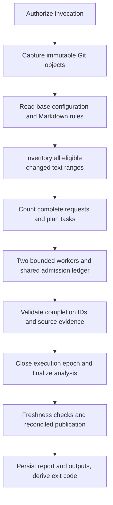

# v2 architecture and contracts

## Flow

The provider boundary uses native REST fetch and has no SDK retries. Counting and generation share the canonical request. The generated wire schema projects Zod into Gemini-compatible constraints: omit `maxItems` and encode `const` literals as single-value enums. The strict local Zod schema retains all original validation limits. See the [incident guide](gemini-troubleshooting.md). The wire schema comes from Zod and is embedded with both prompts and all runtime dependencies in `dist/index.js`.

## Source identity

The source manifest captures repository/PR identity, base branch, base SHA, the unique merge base, head SHA, source-bundle revision hash, model identifier, configuration/prompt/schema/rule hashes, and consumed blob IDs. The bundle's source hash is deterministic across rebuilds and avoids embedding the commit that contains the bundle itself. Use a pinned action SHA externally to identify the installation.

The engine uses an isolated temporary bare Git repository. It fetches commit objects, never checks out PR files, and disables hooks, external diff/text-conversion execution, ambient global Git config, credential helpers, replacement objects, and interactive prompting. Source access requires tracked regular blobs. Symlinks and submodules are not followed. Git name records are NUL-delimited and paths use literal pathspecs.

The comparison is merge-base to head. Zero or multiple best merge bases are unsupported. Renames, deletions, binary files, and metadata-only changes have distinct accounting. Text hunks are initially split into contiguous groups of at most 40 changed lines with nearby raw source; oversized multiline atoms are refined before ownership is assigned. Each LEFT/RIGHT changed range has a stable ID. A modified line contributes removed and added source obligations. Coverage is a count of these declared ranges, not files or tokens.

Binary/non-UTF-8 blobs, regular blobs above 64 MiB, unsupported modes, metadata-only changes, and exact/prefix exclusions are listed separately. Generated text and lockfiles remain eligible. `complete` applies to eligible declared scope and does not hide these source limitations.

## Planning and lookup

One review task is used when the assembled scope fits. Otherwise tasks are packed deterministically, prioritizing security, persistence/migrations, and interfaces. Same-file hunks stay adjacent. Literal one-hop JavaScript/TypeScript imports and nearby conventional test filenames supply explicit relationships; this is intentionally not a generalized dependency graph. Both raw endpoints must accompany an integration question. Relations wholly covered within a review batch do not create separate cross-batch obligations.

Every active review task owns a disjoint set of changed-range IDs. Integration tasks own explicit relation IDs and do not increase changed-code coverage. Split children reduce both obligations and counted input. A result must contain exactly the expected IDs. A context request completes nothing.

Each original lineage gets at most four lookup requests in one round. Each returned range is at most 200 lines, and the round admits at most 8,000 additional counted tokens. Literal search scans at most 2,000 pinned tracked paths and returns at most four ranges per request. Result-limit metadata is supplied to the model. There is no regex execution, network access, shell access, or recursive lookup. Missing essential evidence stays unresolved.

## Completion, recovery, and accounting

A valid application result requires STOP, complete JSON, the wire schema, exact task IDs, and source/anchor validation. STOP alone is insufficient. Local validation confirms structural/source constraints, not the truth of a causal claim. Exact duplicates are deduplicated; invalid candidates are terminal diagnostics. No mandatory praise, starter rules, or merge verdicts exist in v2 prompts.

The ledger synchronously reserves the input ceiling plus output limit before each generation. Reported totalTokenCount settles the reservation once, without separately adding thoughtsTokenCount. Unknown usage retains the reservation. All retries and split descendants share generation-attempt/token budgets. Count calls, source reads, backoff, and publication share the wall-clock deadline.

The separate [usage report](usage-and-cost.md) aggregates reported generation tokens and estimates standard text API cost per attempt. It includes retries and invalid responses, preserves unknown usage, and never prices ledger reservations or double counts thinking.

Generation is bounded to 120 seconds and ends before the finalization reserve. Closure aborts the execution epoch and settles outstanding reservations conservatively. Every continuation checks epoch state before processing results, accepting context, scheduling work, or mutating state. Final reports are detached from worker state, so providers that ignore cancellation cannot reopen finalized reports.

Nonsplitting allowances are shared by a task lineage: one schema/JSON replacement, one retryable transport retry, one compact singleton retry with 8,192 thinking tokens, and one lookup round. Authentication/permanent errors and blocked generations fail the affected obligation explicitly. Partial completion remains useful; no completed obligations means unavailable.

## Publication

Every accepted concern persists in the required main comment or size-triggered overflow pages, irrespective of inline threshold or anchor availability. Comments stay below 50,000 UTF-8 bytes including state and markup. The main comment has locally rendered Dr. Concret.io branding, diagnosis, coverage, SHA, usage and collapsed findings/limitations/history.

The publisher first reconciles existing line/file findings by trusted author, reviewer identity, captured commit, finding ID and anchor. Legacy IDs require a trusted matching parent review. It confirms the required main-comment preparation before sending missing line findings in COMMENT reviews and unanchored single-current-file findings via file comments. Other findings remain in the fallback. A required final update reports delivery; incomplete inline delivery is nonfatal. Previously resolved discussions are preserved. Exact IDs include wording, so this is not semantic deduplication.

Operations retain deterministic IDs, intended-content hashes, finding IDs, required/best-effort flags and delivery state. Trusted marker/author matching, one bounded reconciliation after ambiguous writes, and freshness gates remain mandatory. A possibly accepted write is never blindly recreated. Source identity changes stop subsequent writes while preserving earlier confirmed operations.

### Publication ordering

Workflow creation time, run ID and attempt order results when available. State version 2 parses legacy current/latest/completed records. Distinct historical records are collapsed. The latest known result remains primary when a known older attempt publishes; unknown ordering is explicitly labeled. Required delivery failure does not promote a completed record. Historical full findings remain in comment edit history or their prior detail pages; hidden state stores only compact result metadata.

The examples grant actions: read. When a consumer adds that permission, the publisher attempts bounded timestamp backfills for existing records. Missing metadata keeps the conservative fallback. Cross-workflow consumers must retain the same per-PR concurrency group; read/merge/update is not distributed compare-and-swap.

## Finalization and exit

| Condition | Publication | Exit absent another failure |
| --- | --- | ---: |
| Dry-run, excluded, superseded before publication starts | not_requested | 0 |
| Required and requested inline writes confirmed | published | 0 |
| Required writes confirmed, inline incomplete | partial | 0 |
| Required writes confirmed and failed | partial | 1 |
| Required delivery failed without confirmed required result | failed | 1 |
| Any required write remains unconfirmed | uncertain | 1 |

Configuration/internal errors and unavailable analysis also fail. Findings do not. Supersession is preserved separately from analysisStatus. Outputs/report files are written before ordinary failure exits. Abrupt runner termination, filesystem failure, or process kill cannot guarantee local artifact finalization.

## Verification and official contracts

- [Git merge-base behavior](https://git-scm.com/docs/git-merge-base)
- [Gemini countTokens and generateContentRequest](https://ai.google.dev/api/tokens)
- [Gemini thinking budget](https://ai.google.dev/gemini-api/docs/generate-content/thinking)
- [GitHub action metadata and Node 24](https://docs.github.com/en/actions/reference/workflows-and-actions/metadata-syntax)
- [GitHub review API and commit_id](https://docs.github.com/en/rest/pulls/reviews)
- [GitHub concurrency and queue: max](https://docs.github.com/en/actions/how-tos/write-workflows/choose-when-workflows-run/control-workflow-concurrency)

Official metadata, token-count, review, concurrency, and v7 action release references were checked on 2026-09-15. Paid provider response compatibility and real GitHub runner execution remain release gates; mocked contract checks do not substitute for them.

## Provider projection and compact-v1

The provider-facing source table combines only compatible overlapping/adjacent evidence windows. Every original evidence interval remains explicit. Conflicts, inconsistent line counts and gaps never produce invented combined source. Atom text is omitted only when the included associated evidence reconstructs it exactly. Internal inventory and artifacts retain stable IDs and their existing text representation.

Ordered rules precede variable task data within user content for implicit cache opportunities; they never become system instructions. Lookup results reference source-table evidence. Short aliases exist only on the wire. A request binding includes stable task/mapping identity, rules, source, schema, settings and repair feedback. Responses must return compact-v1 and the exact requestId. Explicit reviewedIds and unresolved entries partition expected obligations before aliases translate to stable IDs and existing validation runs. Old response schemas remain available for internal/historical decoding, never as a live fallback.

The invalid replacement receives a bounded error code, not raw output. Its complete payload is recounted. No retry allowance, input limit, generation budget, output ceiling or thinking setting increases. Attempt metadata records purpose, outcome, request hash, protocol version and effective thinking budget; cache counts remain optional.
